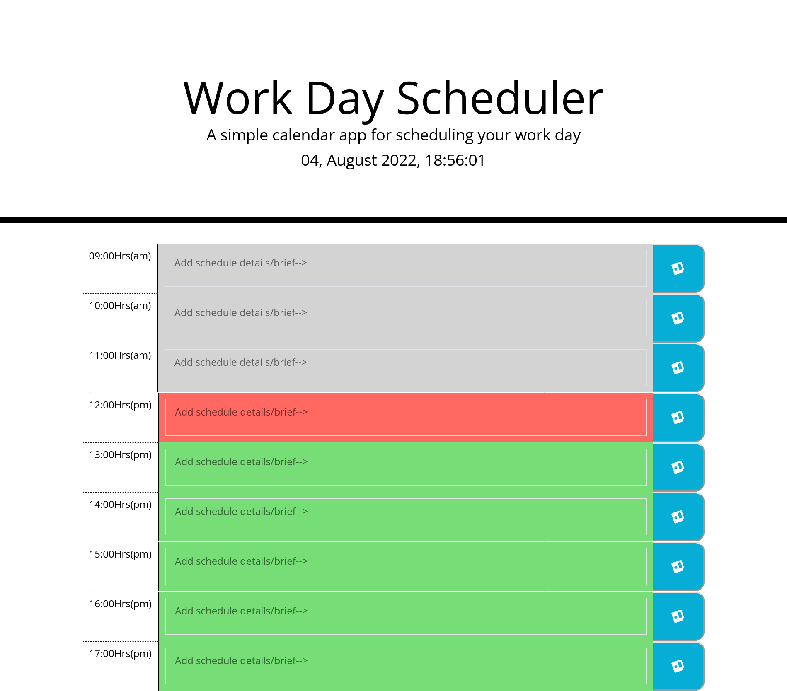
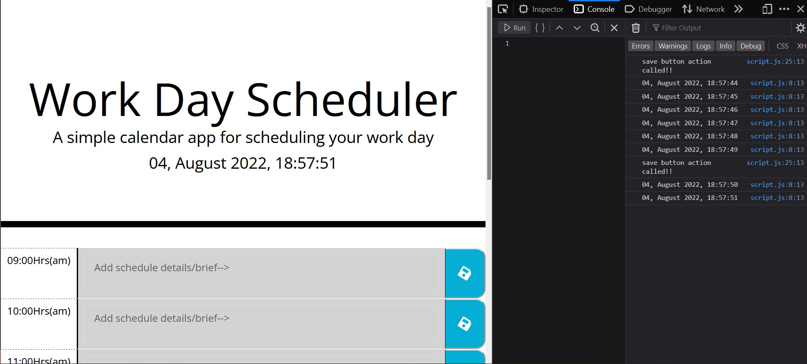

# Work Day Scheduler

## Index

    1. [Description](#description)
    2. [Links](#links)
    3. [Edits/Additions](#edits/additions)
    4. [Challenges](#challenges)
    5. [Screenshots](#screenshots)
    6. [Badges](#badges)
    7. [Credits](#credits)

## Description

In this challenge, we are tasked with creating a simple hourly calender (9-5) work-day scheduler/planner by adding/modifying starter code and creating a javascript code to make it functional.

## Links

    - [Deployed-link](https://a-n26.github.io/Work-day-scheduler/)
    - [Github-repo-link](https://github.com/A-N26/Work-day-scheduler.git)

## Edits/Additions

    Edits:
        <HTML>
            - Added various comments/description (mostly for myself).
            - Added a reset css file link (normalize.css) in hopess to "normalize" the page across different browsers. (see the creator's [about page](https://nicolasgallagher.com/about-normalize-css/) for more details on the same.)
            - Added a title (► Date and Time ◄) in p tag of currentDay after noticing a few seconds of wait/delay time before the dynamic date and time appears on refreshing or opening the url.
            - Added timeblocks from 9am to 5 pm under container (as required) and made adjustments to it to add a text area, save button, corresponding time. And styled them to look aproximately same/similar to the given gif of the assessment.
            - Added an icon from fontawesome to each button.
            - Per curiosity, while looking at the fontawesome documentation came across "animating the fonts" section and, this, added a spin animation to the icon.
            - Changed the placement of the script link tags per priority ordering... i.e, placed the jqrery link above all other script link to call action to jquery for page functionality before all other scripts and so on.
        <CSS>
            - Did not rearrange parent propertie's positions as-is as they reflect the placement of the elements in teh html code and the url.
            - Rearranged the child properties to reflect an alphabetical ordering.
            - Added flex display and flex wrap/nowrap in various properties throughout css.
            - Added border left
            - added max-width and its value to container class to match-up with the container element size in the gif.
            - Added display-3 property and margin-bottom child property to it to reduce the space in-between the main title and p ("a simple ca...") underneeth it.
            - Added lead property and font-size child property to adjust the size of the displaying date and time.
            - Added border-right and padding child properties to hour class.
            - Added fa-save class and child properties to adjust fontawesome icon placement in button.
            - Added media queries for tablet and phone sizes to adjust the icon placement and container placement accordingly. But, while the icon and container are centered, no matter what i do the black dividing-line (that I can't find any element/property attached to...) itself completely shifts towards the left side creating a good enough gap...
    Additions:
        <Javascript>
            - Created a document function main parent under which I placed all the other functions.
            - Created a function to embed time and date from moment js into the webpage.
            -  Per curiousity, ended up creating an interval function to make the date and digital clock update dynamically in realtime.
            -  Created a console-log function for the date and time function (just in case, even as the element is already dynamically updating in real time...). Hid it as a comment.
            -  Created a set of info (per the 9 to 5 time-slot array) to be retrievable from local storage when save button click event action is initiated.
            -  Created a function to make the save button save the entered value in text space which remains in place despite refreshing the page. (hoping to modify the page with a remove/clear button in future to reset the local storge for any given time-slot instead of the whole page...)
            -  Created a console-log function for the save button to show responsiveness in the console when it is clicked (a snip is attached).
            -  Created a function to completely reset all of the local storage values and hid it as a comment as it doesnt serve the intended purpose at the moment.
            - Added comments appropriately.

## Challenges

    - Setting Media queries property to replact per the display size proved a bit challenging. but while it was mostly resolved, there is still 1 slight issue on that end that remains unresolvable for me.
    - Unlike the last homework, this was not as frustrating. Javascript was still the toughest part of the 3 codes by far.

## Screenshots

## Badges

## Credits

    - [Normalize-css](https://github.com/necolas/normalize.css.git)
    - My github page: [A-N26](https://github.com/A-N26)
